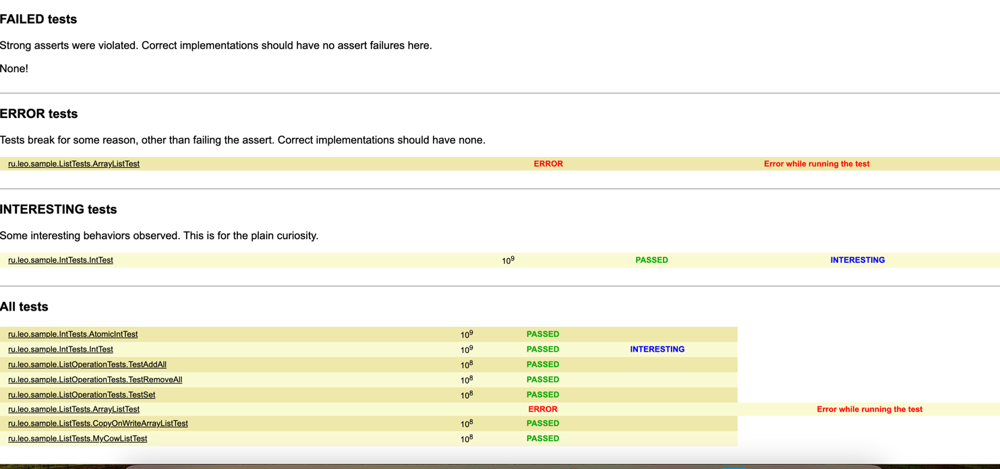
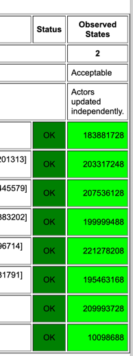
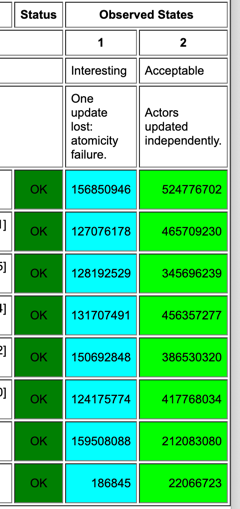
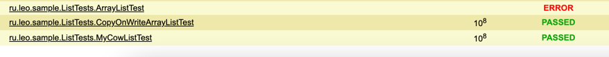
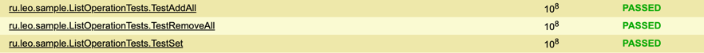

# Отчет
## Что было сделано
+ Реализован CopyOnWriteArrayList ([COWList](./src/main/java/ru/leo/COWList.java))
+ Написаны junit тесты
+ Изучен фреймворк jcstress, написаны тесты

## Анализ jcstress
Результаты всех тестов можно найти [тут](./reports/jcstress/index.html)

### Введение
В рамках освоения jcstress сначала были написаны тесты проверяющие работу встроенных java типов и коллекций 
для проверки их поведения в многопточно среде.

### IntTests и ListTests
[IntTests](./src/jcstress/java/ru/leo/sample/IntTests.java) проверяют работу int изменяемого двумя разными потоками и работу AtomicInteger.

На репорте видно, что AtomicInteger показывает результат 2 (оба потока совершили инкремент),
то есть он работает корректно.

А вот примитив в ~30 процентов случаев теряет один из инкрементов.

[ListTests](./src/jcstress/java/ru/leo/sample/IntTests.java) проверяют работу ArrayList, CopyOnWriteArrayList из java 
и мой COWList на операциях добавлениях. Можем видеть, что CopyOnWriteArrayList, COWList работают корректно 
в отличие от ArrayList.  

### ListOperationTests
Это основной класс с проверками моего COWList.
#### TestSet
Данный тест проверяет корректность изменение элемента по индексу из разных потоков.

#### TestAddAll
Данный тест проверяет корректность добавления множества элементов из разных потоков.

#### TestRemoveAll
Данный тест проверяет корректность удаления множества элементов из разных потоков.

Видим, что все тесты проходят, более детально посмотреть результаты можно, 
провалившись глубже по [репорту](./reports/jcstress/index.html). 